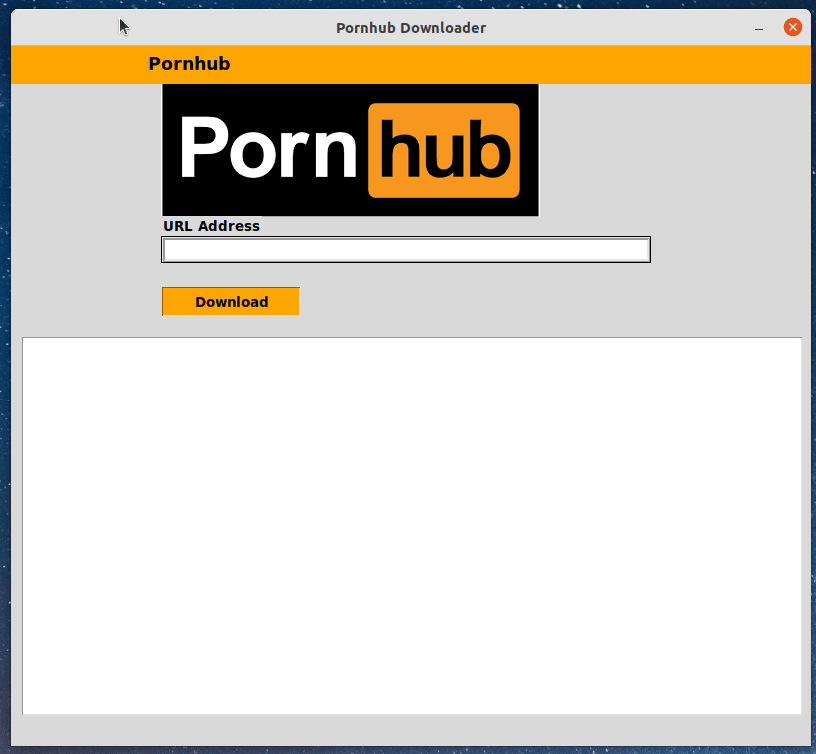

# Pornhub_dl_gui


<b> Tu propio descargador de Pornhub (GUI) escrito en python.</b>
<p>
  
  
  
  
  
  

  
  
  
</p>


Leer en otros idiomas: [English](README.md) | [Español](README.es.md) | [Russian](README.ru.md) | [हिन्दी](README.hindi.md) | [中國人](README.chinese.md) 





## Cómo instalar y ejecutar
____
### Clonar el repositorio
 
```sh
$ cmd
$ git clone https://github.com/BEPb/Pornhub_dl_gui
$ cd Pornhub_dl_gui
```
 
### Instalar los paquetes necesarios (Instalar dependencias)
```sh
$  pip install -r requirements.txt
```

## Uso
Para iniciar la GUI:
```
python3 -m pornhub_dl
```

