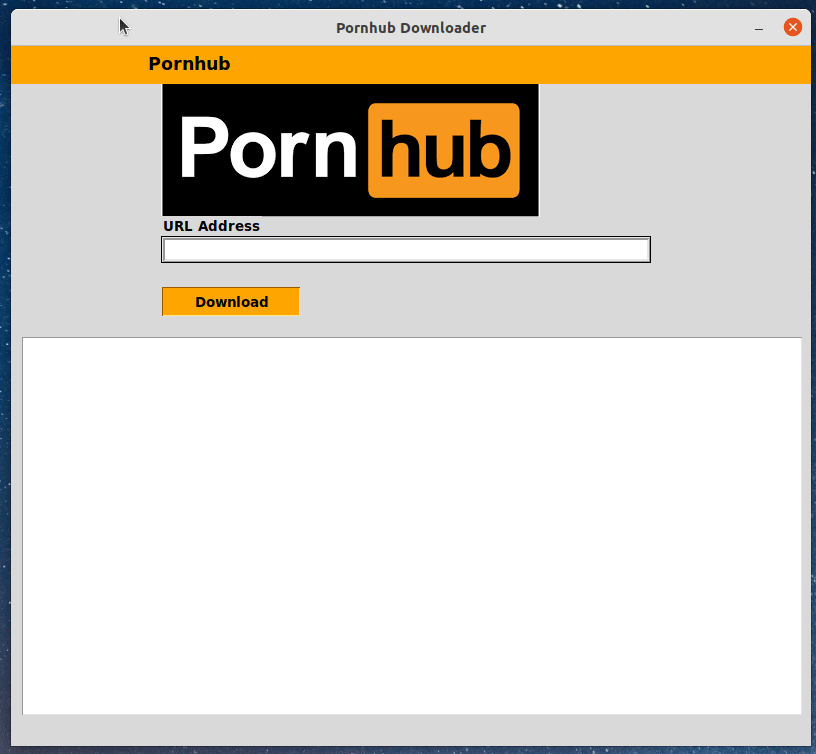

# Pornhub_dl_gui


<b> Your own Pornhub downloader (GUI) written in python.</b>
<p>
  
  
  
  
  
  

  
  
  
</p>


Read in other languages: [Español](README.es.md) | [Russian](README.ru.md) | [हिन्दी](README.hindi.md) | [中國人](README.chinese.md) 





## How to install and run
____
### Clone the repository
 
```sh
$ cmd
$ git clone https://github.com/BEPb/Pornhub_dl_gui
$ cd Pornhub_dl_gui
```
 
### Install the necessary packages (Install dependencies)
```sh
$  pip install -r requirements.txt
```

## Usage
To launch the GUI:
```
python3 -m pornhub_dl
```

